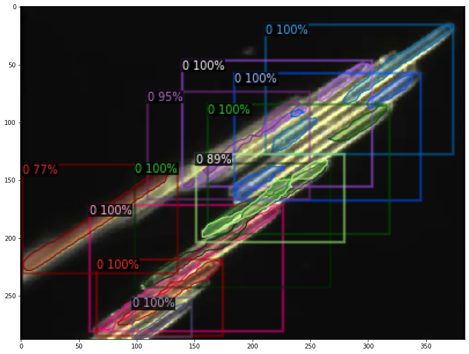
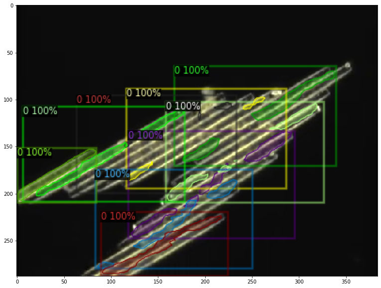
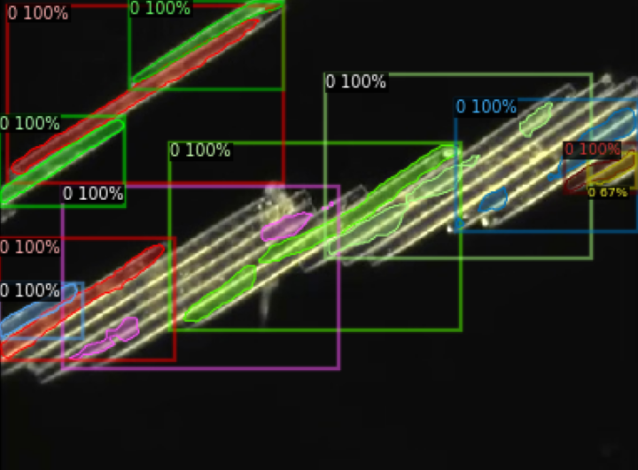
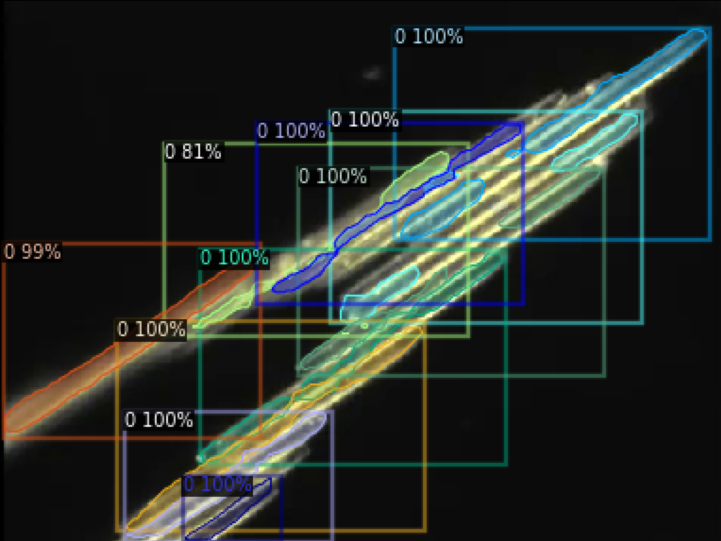
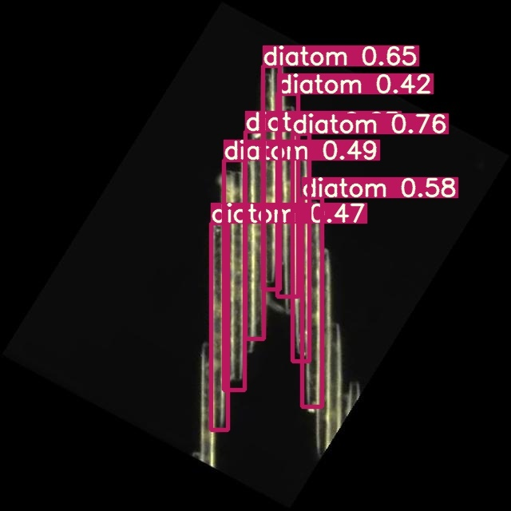
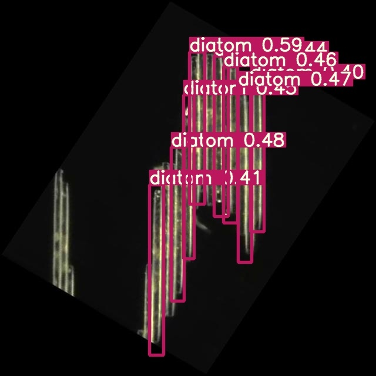
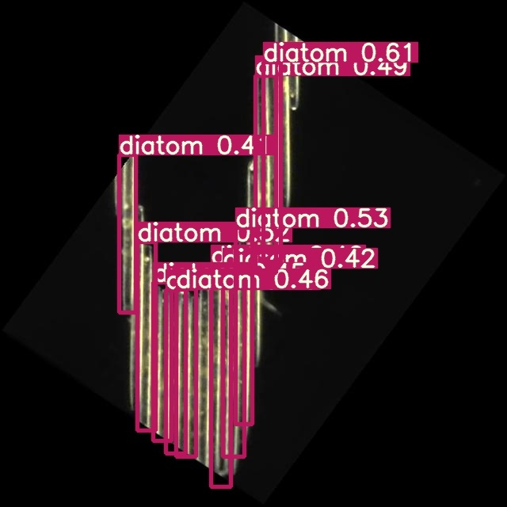

# Diatom localization using deep learning

+ The notebooks aim at using neural-network-based models, object detection and instance segmentation for locating diatom cells in a given image.
+ The details of the approach, models, dataset and an overview of Non-neuronal cognition is summarized in this [document](https://docs.google.com/document/d/17pQMqYRGxiQNO65xh1X2QvsZXYJX9cVj0u4RGTv0K_Y/edit?usp=sharing).

## Notebooks

+ `diatom_instance_segmentation.ipynb` : the notebook uses MaskRCNN in Detectron2 library for diatom localization using segmentation mask prediction.
    + Shown below are some of the results on validation images:
        
        

        
        
        

        

        
        
        

+ `diatom_object_detection.ipnb` : the notebook uses YoloV5 and Scaled YoloV4 for diatom localization using bounding box prediction.
    + Shown below are some of the results on validation images:
        
        

        
        
        
        

