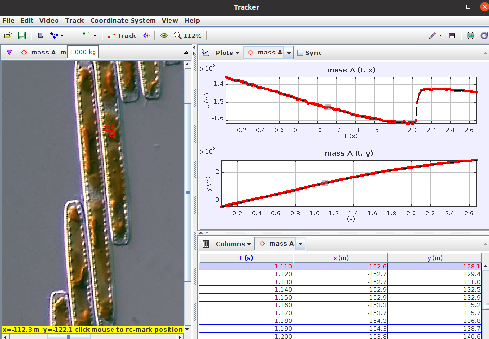
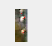
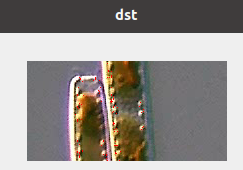

# Devlog

This is a development log for answering if Bacillaria has smooth movement or not using visual tracking.

## Local installation

The project was install locally using 
`
torch                   1.12.1+cu113
detectron2              0.6
`

These links were helpful - [Torch installation](https://detectron2.readthedocs.io/en/latest/tutorials/install.html) and [Pytorch local installation](https://pytorch.org/get-started/locally/)

## 2022-08-28

I've installed the requirements to activate the Object detection and instance segmentation. 

| Explanation                               | Image                                                        |
| ----------------------------------------- | ------------------------------------------------------------ |
|                                           |                                                              |
|                                           |                                                              |
| I've used the tool of tracking in a video |  |

## 2022-08-29

| Exp                                                          | Img                                                          |
| ------------------------------------------------------------ | ------------------------------------------------------------ |
| I'm trying to harris corner detec the spots                  |  |
| This is a zoom out of the spots . It's from the right side.  |  |
| Measuring the pixels it seems like it's around 5-9 pixles. Let's try this wi |                                                              |

